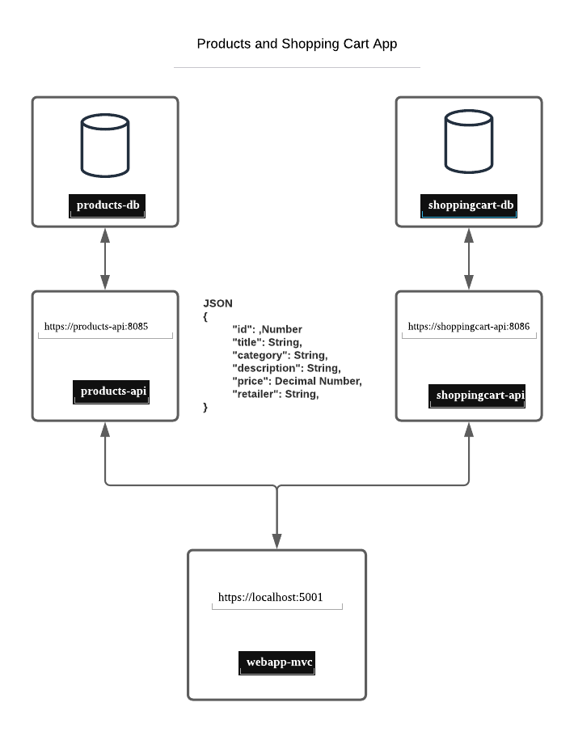

# WebAppMvc

### System Overview

#### Architecture


The system consists of an MVC web application which consumes services from two apis - product and shopping-cart.  The web application can list all products, show product details, add a product to the shopping cart and remove a product from the cart.

The product and shopping-cart apis are each connected to a separate MSSQL Server database.

The databases, apis and mvc web application all run in docker containers.

### Developer Setup
Refer to docs for setup of Api and MVC

Add Models - Product, CartItem 

Add Controller - Product, CartItem

Add View -  Product, CartItem

Add Docker 
Change localhost to docker container names in api calls

#### Docker Containers
Containers Docker compose - One compose to rule them all

### packages to add
```shell
dotnet add package Newtonsoft.Json

```

### Github repository
https://github.com/m-eamon/WebAppMvc.git


### Troubleshoot

DBCreate - Fix

####   
I think there is an issue with the HTTPS development certificate of localhost. When the product or shopping cart api is called from the mvc, the following error is generated:

```
 HttpRequestException: The SSL connection could not be established, see inner exception.

```

This issue is resolved by forcing certificate trust in the api calls.  This code should be removed for properly trusted certificates.  

```csharp
 public IActionResult Index()
{
            
    var httpClientHandler = new HttpClientHandler();
    httpClientHandler.ServerCertificateCustomValidationCallback = (message, cert, chain, sslPolicyErrors) =>
    {
                return true;
    };

```

Service Issue - Could not work - Refactor
 


This issue
                // this should be in a separate file
                client.BaseAddress = new Uri("https://products-api:8085");

                //client.BaseAddress = new Uri("https://localhost:5006");


Port 1433 issue for db connection
Routing in MVC
View - Presentation Layer (View layer) - Much work